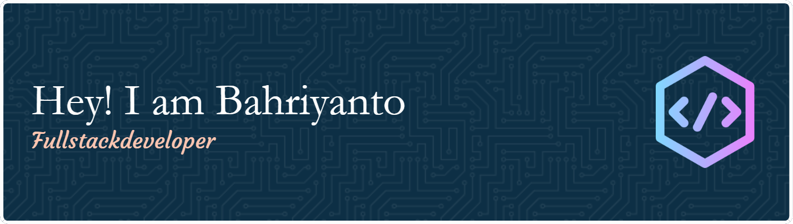

  

  

 
 <!--  -->

Hello there! My name is Bahriyanto Anang, and I am a passionate web developer with a strong expertise in PHP and web frameworks like CodeIgniter 3 and 4, as well as Laravel. Additionally, I possess the skills to create impressive frontend websites using Vue.js and Nuxt.js.

### 🛠️ Language and tools

### 🔥 My Stats 

<!--  -->

###

<picture>
  <source media="(prefers-color-scheme: dark)" srcset="https://raw.githubusercontent.com/bahriyanto31/bahriyanto31/output/pacman-contribution-graph-dark.svg">
  <source media="(prefers-color-scheme: light)" srcset="https://raw.githubusercontent.com/bahriyanto31/bahriyanto31/output/pacman-contribution-graph.svg">
  
</picture>

###

<!--
**bahriyanto31/bahriyanto31** is a ✨ _special_ ✨ repository because its `README.md` (this file) appears on your GitHub profile.

Here are some ideas to get you started:

- 🔭 I’m currently working on ...
- 🌱 I’m currently learning ...
- 👯 I’m looking to collaborate on ...
- 🤔 I’m looking for help with ...
- 💬 Ask me about ...
- 📫 How to reach me: ...
- 😄 Pronouns: ...
- ⚡ Fun fact: ...
-->
